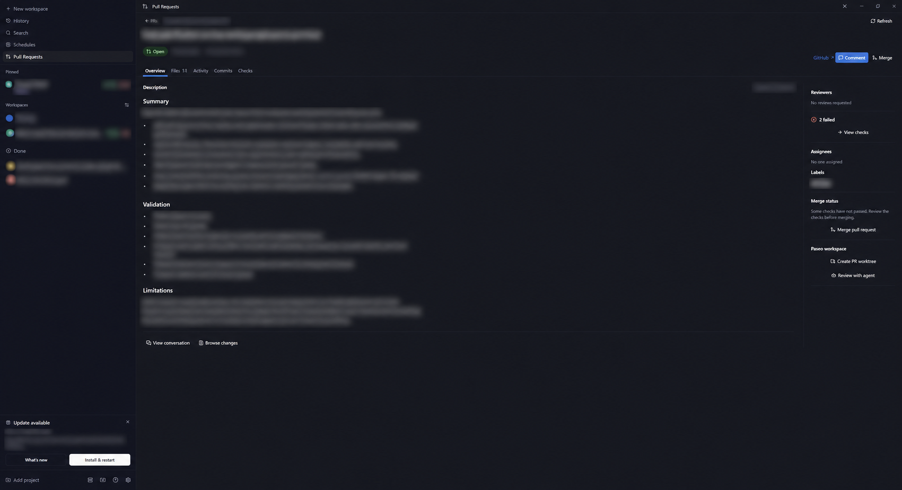
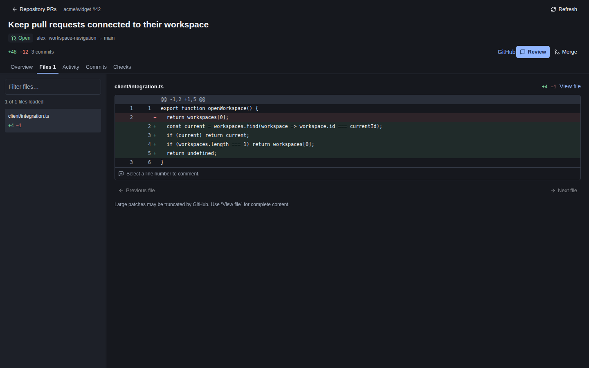

# Pull Requests for Paseo

Browse and review GitHub pull requests in Paseo, including private repositories.





## Installation

Requires Paseo **0.9.x**, npm, and GitHub CLI on the daemon host. Enable **Settings → Plugins**, then run as the daemon user:

```sh
gh auth login --hostname github.com
paseo plugin install npm:paseo-plugin-pull-requests
```

Open **Pull Requests** in the sidebar. Connected clients use the daemon's GitHub account.

## Features

- Authored, assigned, and requested-review PRs with search and filters.
- Descriptions, Paseo-highlighted unified or split diffs, comments, reviews, commits, checks, and merging.
- GitHub-colored labels and preview deployment links on PR cards; both also appear in details when available.
- Edit labels, assignees, requested reviewers, and the target branch in place.
- Workspace header **PR** button for linked PRs, with a **Preview** button beside it when a preview deployment exists.
- Sidebar, Command Center, and workspace panels.
- Reuse or create PR workspaces; launch Terminal, Codex, Claude, or other ready providers from the **Paseo** menu. Terminal opens its workspace; select the terminal tab manually.
