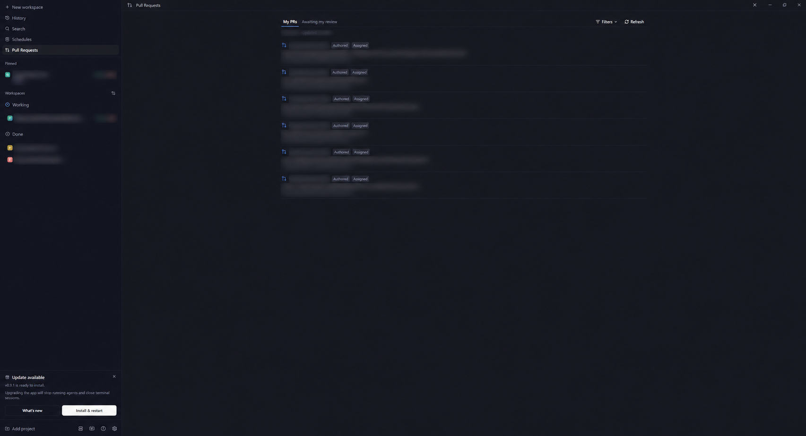

# Pull Requests for Paseo

All your GitHub PRs in Paseo—including private repositories.



[PR details](images/pr-details.png) · [File diffs](images/files-diff.png) — private information blurred in all previews.

- **My PRs** (default): authored by or assigned to you, without duplicates.
- **Awaiting my review**: requests for you or your teams.
- **Filters**: owner, repository, draft status, relationship, and title.
- **Review**: descriptions, full-width diffs, comments, approvals, requested changes, checks, and merging.
- **Paseo integration**: sidebar, workspace panels, `/prs`, PR worktrees, and review agents.

## Install

Requires **Paseo 0.9.x** on the daemon and clients, **npm**, and **gh** on the daemon host. Enable plugins in **Settings → Plugins**, then run as the daemon user:

```sh
gh auth login --hostname github.com
paseo plugin install npm:paseo-plugin-pull-requests@0.1.0
```

Open **Pull Requests** in the sidebar. All connected clients use the daemon's GitHub account; credentials stay on the host. GitHub permissions and branch protection apply.

[GitHub release](https://github.com/Ironside-Software/pull-requests-paseo-plugin/releases/latest) · [npm](https://www.npmjs.com/package/paseo-plugin-pull-requests) · [MIT license](LICENSE)

## Development

```sh
npm ci --ignore-scripts
npm run typecheck
npm test
```

After local edits: `paseo plugin reload pull-requests`. Diagnose problems with `paseo plugin logs pull-requests`.
